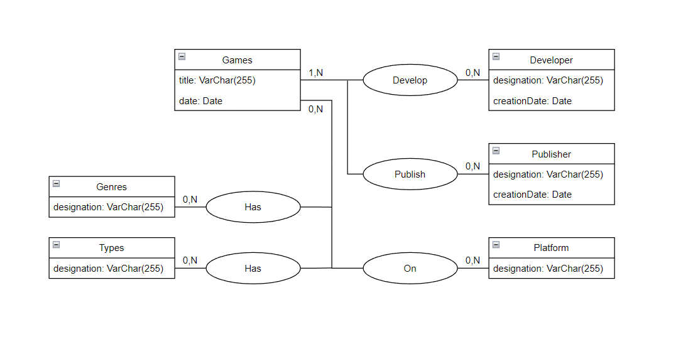

# Base de données de jeux vidéos
## Installation
- Cloner le projet
- Installer les dépendances avec `composer install`
- Mettre les identifiants de connexion à la base de données dans le fichier `.env`
- Créer la base de données avec `php bin/console doctrine:database:create`
- Créer les tables avec `php bin/console doctrine:migrations:migrate`
- Charger les données avec `php bin/console doctrine:fixtures:load`
- Lancer le serveur avec `symfony server:start`
- Pour voir les jeux vidéos, aller à l'adresse `http://localhost:8000/game`
## MCD DB

(les cardinalités ne sont pas forcément exactes)
## Transactions
- Des genres et des types sont ajoutés dans la même transaction
- Lors d'un ajout d'un publisher, un développeur enfant est automatiquement créé
- Un jeu avec un genre et un type non existant est automatiquement créé
## Triggers
- Lors de la suppression d'un publisher, tous les developpeurs associés sont supprimés
- Lors de la suppression d'un développeur, tous les jeux associés sont supprimés
## Contraintes
- Un jeu est développé par au minimum un développeur
- Un jeu est édité par au minimum un éditeur
- Un jeu est disponible sur au minimum une plateforme
- Chaque date de sortie est inférieure à la date du jour
- Aucune donées ne peut être vide, chaque champ doit être rempli